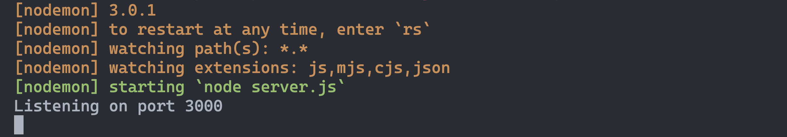

<h1>
  <span class="headline">Intro to Express</span>
  <span class="subhead">Building an Express Server</span>
</h1>

**Learning Objective:** By the end of this lesson, students will understand how to set up a basic Express server and make it listen for requests.

## Setting Up Express in your project

Before we start coding, let's set up the Express framework:

### Installing Express

- To include Express in your project, run:

  ```bash
  npm i express
  ```

> 📚 Remember `i` is shorthand for `install`. This command adds the Express module to your project by adding it to your `package.json` and `node modules` folder.

### Writing the server code

Now, let's add the `Express` package to the `server.js` file that will house our server code:

Importing `Express` and creating the application:

```js
// Import Express
const express = require('express')

// Create an Express app
const app = express()
```

Here, `express` is a function that, when called, returns an instance of an Express application (`app`).

> 📚 By convention the **`server.js`** file is typically the main entry point and configuration file for setting up an Express web server.

Defining routes and starting the server:

```js
// Define routes here (we'll add them soon)

// Listen for requests on port 3000
app.listen(3000, () => {
  console.log('Listening on port 3000')
})
```

- The `listen` method starts the server on a specified port (3000 in this case).

### Understanding ports

Think of ports like locked doors on a computer. When an application is running on a port, the door unlocks and we can enter, allowing us to interact with the application running on that port. Port `3000` is a common choice for local development, but you can use most other unreserved ports.

## Running your Express server with nodemon for development

Running a JavaScript file in the terminal with the `node` command executes the file in its current state. As you build and modify server files, you'll often want to test changes quickly. This typically requires saving your file and rerunning the server code to apply these changes. Manually restarting the server for every update can become tedious, but thankfully this process can be automated with a helpful NPM package [nodemon](https://www.npmjs.com/package/nodemon).

nodemon is a valuable tool for Node development. It monitors your files for changes and automatically restarts the application, removing the repetitive task of manual server restarts after each modification.

### Installing nodemon

Update an existing nodemon installation, or install Nodemon globally with this command in your terminal:

```bash
npm i -g nodemon
```

### Running the server with nodemon

Start your server using the `nodemon` command in your terminal:

```bash
nodemon server.js
```

## Check the terminal

Once the server is running, you should see a confirmation in your terminal, indicating that it's listening on port 3000. These colorful logs come from the nodemon package and provide helpful information about the status of your server as your code changes. 



## Stopping your server

With the terminal selected, use `Ctrl + C` to end the `nodemon` process. This key combination sends a SIGINT (signal interrupt) to the Node process running your Express server, causing it to terminate gracefully.

Let's shut it down!

**`Ctrl + C`**

## Simplifying server startup with `nodemon` in `package.json`

If you set `server.js` as the main entry point in your `package.json`, you can start your app with just the `nodemon` command.

1. Open your project's `package.json` file.

2. Modify the `main` Property:
   - Look for the `main` property, which specifies the entry point file of your application.
   - Change its value to `server.js` (or the name of your server file if it's different).

```json
{
  "name": "your-app-name",
  "version": "1.0.0",
  "description": "",
  "main": "server.js",
  // ... other properties ...
}
```

### Running your server with nodemon

With `server.js` set as the main file, you can now start your server with just the `nodemon` command in your terminal:

```bash
nodemon
```

nodemon will automatically reference the `main` property in `package.json` and launch the specified server file.

> 🧠 This setup is especially useful when working with multiple projects, as it standardizes the server start command across different applications.
