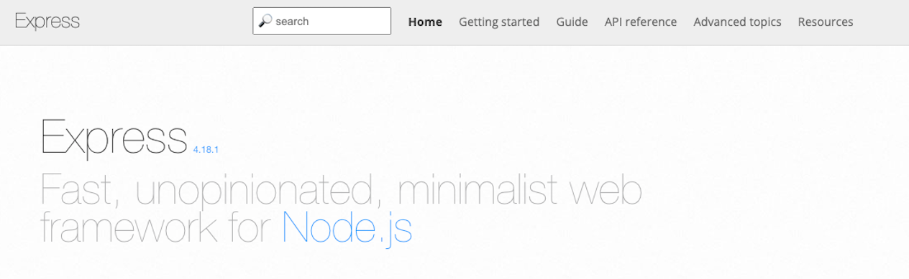
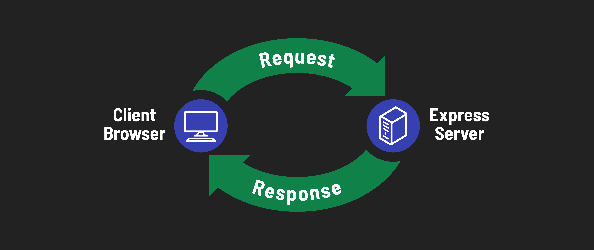

<h1>
  Intro to Express
  Concepts
</h1>

**Learning Objective:** By the end of this lesson, students will understand the basics of the Express framework, its applications, and the core functionalities of web application frameworks.

## Introduction to the Express framework

[**Express**](https://expressjs.com/), the most widely used web application framework for Node.js, stands out for its flexibility and minimalistic approach. This popular framework simplifies the process of building robust server-side applications and APIs with Node.js.

### Why choose Express?

- **Simplicity and Control**: Express's minimalistic nature means less initial overhead for developers, offering more control over the architecture and features of their applications.
- **Versatility**: It's well-suited for a range of applications, including:
  - **Web Applications**: Serving dynamic HTML content.
  - **Web Servers**: Handling static and dynamic requests efficiently.
  - **APIs**: Creating endpoints for client-server communication.

In this module, we'll focus primarily on developing web applications using Express.

## Core functionalities of web application frameworks

Express exemplifies the key features of web application frameworks, which are essential for building efficient server-side solutions:

1. **Routing**: Defining routes (URLs) that client applications can request, crucial for organizing different parts of your application.
2. **Request Handling**: Processing incoming requests, parsing data, and making decisions based on the route and HTTP method.
3. **Response Generation**: Combining data with templates to create dynamic content, or directly sending data as a response to client requests.

Understanding these core concepts is vital for developing web applications that are responsive, dynamic, and user-friendly.