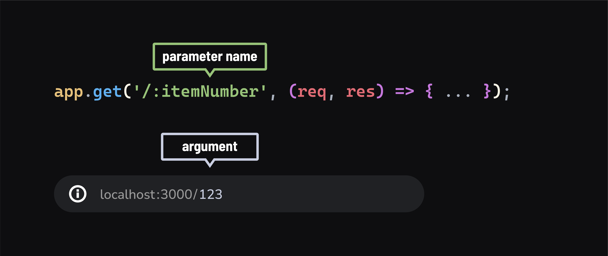

<h1>
  <span class="headline">Intro to Express</span>
  <span class="subhead">URL Parameters</span>
</h1>

**Learning Objective:** By the end of this lesson, students will be able to use URL parameters in Express routes to handle dynamic data in requests.

## Understanding URL/Route Parameters

URL Parameters, also known as Route Parameters, are akin to function parameters but within the context of URL paths. They allow dynamic data, like identifiers for specific resources, to be passed through the URL path of an HTTP request.



In simpler terms, it allows us to pass small amounts of information from the browser to the server via the URL.

### URL params in Express

In Express, we define these parameters in the path string, using a colon `:` followed by the parameter name:

```javascript
app.get('/:itemNumber', (req, res) => {
  // Accessing the parameter
  console.log(req.params.itemNumber);  // Output could be 123, 456, etc.

  // Sending a response with the parameter
  res.send(`<h1>Item ${req.params.itemNumber}</h1>`);
});
```

> Just like parameters in JavaScript functions are placeholders for actual values passed during function invocation, URL parameters are placeholders in route definitions. The actual values are provided in the URL when a request is made from the browser.

### Testing in the browser

Try visiting `localhost:3000/123` and `localhost:3000/456` in your browser. Notice how the item number in the `console.log` and `<h1>` response changes according to the URL.

How this works:

- The path `/:itemNumber` is a template. When a request like `localhost:3000/123` is received, Express maps `'123'` to `itemNumber`, which is then accessible via `req.params.itemNumber` on the request object.

### Example with `req.params`

- If you `console.log(req.params)` in the route above, you'll get an output like `{ itemNumber: '123' }` or `{ itemNumber: '456' }`, depending on the request URL.

## Route order and URL parameters

When planning your routes in Express, the order of route definitions is crucial when working with URL parameters

Take a look at the routes below:

```js
app.get('/:name', (req, res) => {
  res.send(`Hello ${req.params.name}!`);
});

app.get('/about', (req, res) => {
  res.send('About Page');
});
```

- In the provided example, the first route `/:name` is dynamic, meaning it uses a route parameter `:name` to match any URL path that starts with a `/` followed by any string. This pattern is quite broad and will match a wide range of URLs, including something like `/about`.

- The issue arises because this general pattern also matches the specific URL `/about`. As a result, a request to `/about` gets intercepted by the first route `/:name` instead of reaching the intended `/about` route.

- This behavior makes the specific `/about` route essentially unreachable, as the server always responds with the ***first matching route it encounters***, which in this case is the more generic `/:name` route.

- To prevent this, it's important to order routes carefully in Express. More specific routes, like `/about`, should be defined **before** more generic routes, like `/:name`, to ensure they are correctly matched and accessible.

## 🎓 You Do

### Create a Greeting Route

Practice your new skills:

- Create a route at `/greet/:name`.

- Have it respond with `"Hello, [name]!"`, replacing `[name]` with the actual name provided in the URL.

- Test your route by navigating to `localhost:3000/greet/yourname` in your browser.

## Query Parameters

Another effective way to pass additional information in a URL to a server is through query parameters. Query parameters are added to the end of a URL after a `?` and are formatted as `key=value` pairs. In Express, these parameters are conveniently accessible through the `req.query` object.

For example, consider the following URL `localhost:3000/hello?name=Christy&age=32.` 

This URL contains two query parameters: 

- `name` with a value of "Christy"
- `age` with a value of "32". 

These parameters follow the `?` symbol in the URL and are separated by `&`.

When a request is made to this URL, the Express server can retrieve these values from the `req.query` object. The `name` and `age` keys in the `req.query` object correspond to the query parameters in the URL. The server can then use this data, for example, to personalize a response message.

Here's how the server processes this request in Express:

```js
app.get('/hello', (req, res) => {
    // Accessing query parameters from the request
    const name = req.query.name;
    const age = req.query.age;

    // Using the query parameters to customize the response
    res.send(`Hello there, ${name}! I hear you are ${age} years old!`);
});
```

> 🧠 If we were to `console.log` the `req.query` object, you'll see an object representation of the query parameters, which in this case would be `{ name: "Christy", age: "32" }`. This object structure makes it simple to access and use the parameters within the server's response logic.